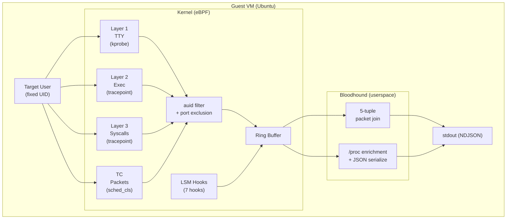

# Bloodhound

eBPF-based behavioral tracing daemon for isolated VMs.

Bloodhound is a resident daemon that traces user behavior inside QEMU/KVM
guest VMs. It captures every kernel-level event attributable to a target
user — syscalls, TTY I/O, network packets, and process lifecycle — correlates
them via `auid` (audit login UID), and emits structured events as NDJSON.



## Features

- **Layer 1 — TTY capture**: kprobe hooks on `pty_write` / `n_tty_read` for raw terminal I/O
- **Layer 2 — Process tracking**: `execve` / `execveat` tracepoints with full argv capture
- **Layer 3 — Syscall tracing**: raw syscall stream + rich extraction for 30+ syscalls (file, network, process, directory operations)
- **Packet capture**: TC (Traffic Control) hooks on all network interfaces, ingress and egress
- **Tamper resistance**: 7 LSM hooks protect the daemon from the target user (task_kill, bpf, ptrace, file_open, inode_unlink, inode_rename, task_fix_setuid)
- **Structured output**: All events emitted as NDJSON with unified `BehaviorEvent` schema

## Requirements

| Component       | Version                        |
|-----------------|--------------------------------|
| Rust            | nightly (see `rust-toolchain.toml`) |
| Target kernel   | 6.8+ (BTF + BPF LSM enabled)  |
| Target OS       | Ubuntu (LTS)                   |
| Docker          | Required for production builds |
| QEMU/KVM        | Required for E2E tests         |

> [!IMPORTANT]
> **Development environment**: Linux or WSL2 is required for building and
> running E2E tests. The eBPF daemon depends on `CONFIG_AUDIT` (for
> `loginuid`/`auid` tracking) and KVM acceleration, neither of which is
> available on macOS. Docker-based builds (`make build-docker`) work on
> macOS but the E2E test pipeline does not.

## Quick Start

### Build (via Docker — recommended)

```bash
# Build the static musl binary
make build-docker

# Output: target/docker/bloodhound
```

### Build & Deploy to E2E VM

```bash
cd e2e

# Build rootfs, boot VM, deploy binary, run tests
bash scripts/deploy.sh --no-cache   # full rebuild
bash scripts/deploy.sh              # incremental (uses Docker cache)

# Run E2E tests
cd tests && ../venv/bin/python3 -m pytest --ssh-port=2222 --ssh-host=localhost
```

### Run the Daemon

```bash
# Inside the VM (as root):
bloodhound --uid 1000           # trace user with UID 1000
bloodhound --uid 1000 --exclude-ports 22  # exclude SSH traffic
```

### View Logs with TUI

```bash
cargo run --package bloodhound-tui -- /path/to/bloodhound.ndjson
```

## Technology Stack

| Component        | Choice                                  |
|------------------|-----------------------------------------|
| BPF programs     | Rust (`no_std`) via [Aya](https://aya-rs.dev/) |
| Userspace daemon | Rust via Aya + tokio                    |
| TUI viewer       | Rust via [Ratatui](https://ratatui.rs/) |
| BPF-to-user pipe | `BPF_MAP_TYPE_RINGBUF`                  |
| Output format    | NDJSON (`BehaviorEvent` schema)         |
| Build            | Docker multi-stage (musl static binary) |
| E2E tests        | QEMU/KVM + pytest                       |

## Development Notes

### Kernel Struct Offsets

The eBPF code reads `task_struct` fields (`loginuid`, `sessionid`, `tgid`)
using hardcoded byte offsets. These are **kernel-version-specific** and must
be verified on the **target VM kernel**, not the build host.

See [docs/ebpf-offsets.md](docs/ebpf-offsets.md) for the verification procedure.

### BPF Verifier

eBPF programs must pass the kernel's BPF verifier at load time. Common
pitfalls are documented in [docs/build.md](docs/build.md#bpf-verifier-gotchas).

## License

Apache License 2.0 — see [LICENSE](LICENSE).

Copyright 2026 OldBigBuddha
