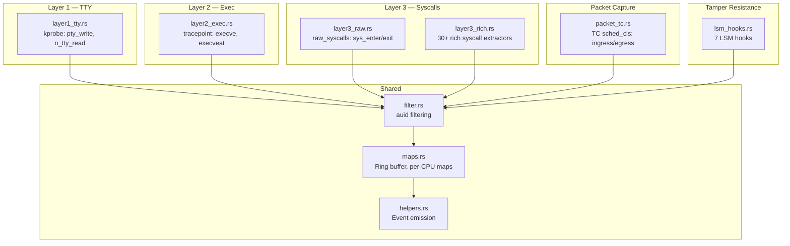

# bloodhound-ebpf

eBPF programs that run inside the kernel to trace user behavior. Compiled as `no_std` Rust targeting `bpfel-unknown-none` via the [Aya](https://aya-rs.dev/) framework.

## Program Layers

## Modules

| Module | Hook Type | Description |
|--------|-----------|-------------|
| `layer1_tty.rs` | kprobe | `pty_write` / `n_tty_read` — raw terminal I/O capture |
| `layer2_exec.rs` | tracepoint | `execve` / `execveat` — process execution with argv |
| `layer3_raw.rs` | tracepoint | `raw_syscalls` — generic syscall number + return code |
| `layer3_rich.rs` | tracepoint | 30+ syscall-specific extractors (openat, read, write, connect, bind, mkdir, etc.) |
| `packet_tc.rs` | sched_cls | TC ingress/egress — Ethernet header + first 34 bytes |
| `lsm_hooks.rs` | LSM | 7 hooks: task_kill, bpf, ptrace, file_open, inode_unlink, inode_rename, task_fix_setuid |
| `filter.rs` | — | `should_trace()` — auid-based event filtering |
| `maps.rs` | — | BPF map definitions (ring buffer, per-CPU arrays, hash maps) |
| `helpers.rs` | — | `emit_event()`, `bpf_memcpy()`, drop counter |

## Kernel Struct Offsets

This crate uses hardcoded `task_struct` byte offsets. See [docs/ebpf-offsets.md](../docs/ebpf-offsets.md) for the offset table and verification procedure.

> ⚠️ Always verify offsets on the **target VM kernel**, not the build host.
