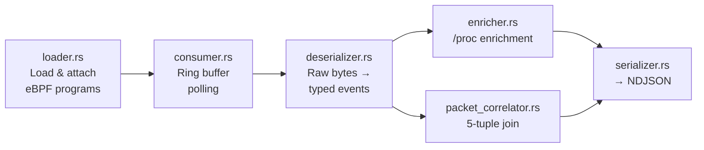

# bloodhound

Userspace daemon that loads eBPF programs, consumes events from the ring buffer, and emits structured NDJSON to stdout.

## Architecture



## Modules

| Module | Description |
|--------|-------------|
| `main.rs` | Entry point, tokio runtime, signal handling |
| `cli.rs` | Command-line argument parsing (`--uid`, `--exclude-ports`) |
| `loader.rs` | Loads eBPF bytecode via Aya, attaches tracepoints/kprobes/TC/LSM |
| `consumer.rs` | Polls the BPF ring buffer for raw events |
| `deserializer.rs` | Deserializes raw byte buffers into typed event structs |
| `enricher.rs` | Enriches events with `/proc` data (cwd, exe path, fd info) |
| `packet_correlator.rs` | Correlates PACKET events with socket syscalls via 5-tuple |
| `serializer.rs` | Serializes events to NDJSON (`BehaviorEvent` schema) |
| `drop_counter.rs` | Polls the BPF drop counter and reports to stderr |
| `shutdown.rs` | Graceful shutdown coordination |

## Build

```bash
# Via Docker (recommended)
make build-docker

# Native (Linux only, requires nightly + bpf-linker)
cargo build -p bloodhound --release --target x86_64-unknown-linux-musl
```

The eBPF bytecode is compiled by `build.rs` via `aya_build::build_ebpf()` and embedded in the binary at compile time.

## Usage

```bash
bloodhound --uid 1000                     # trace user with UID 1000
bloodhound --uid 1000 --exclude-ports 22  # exclude SSH traffic
```
