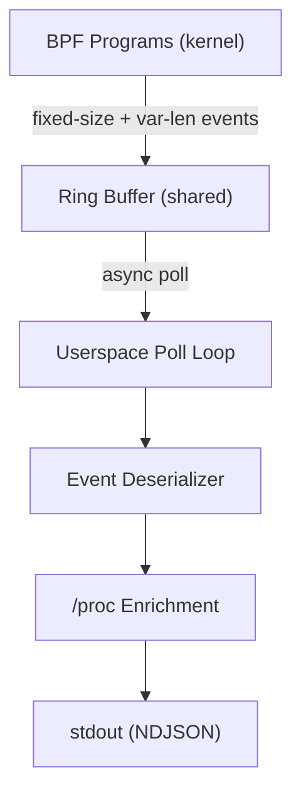

# Data Pipeline

## Ring Buffer Configuration

| Parameter         | Value    | Notes                                    |
|-------------------|----------|------------------------------------------|
| Map type          | RINGBUF  | Single shared buffer across all CPUs     |
| Size              | DECIDED  | Configurable via --ring-buffer-size;     |
|                   |          | default 4MB; must be power of 2          |
| Event ordering    | FIFO     | Global ordering guaranteed (key for      |
|                   |          | downstream sequence analysis)            |
| Overflow policy   | DECIDED  | Drop (bpf_ringbuf_reserve returns NULL); |
|                   |          | BPF global counter tracks drop count;    |
|                   |          | userspace polls counter periodically     |

## BPF-to-Userspace Event Format

BPF programs emit compact binary events into the ring buffer. These are
deserialized in userspace into the BehaviorEvent JSON schema (see
[output-schema.md](output-schema.md)).

Each BPF event from Layer 1-3 and LSM hooks carries at minimum:

- Event discriminant (u8: which hook produced it)
- Timestamp (u64: nanoseconds, see below)
- auid (u32)
- sessionid (u32)
- pid (u32)
- ppid (u32)
- comm ([u8; 16])
- Hook-specific payload (variable length)

**Exception: PACKET events (TC hooks)** do not have process context.
TC programs cannot access `task_struct`, so PACKET events carry only:

- Event discriminant (u8)
- Timestamp (u64)
- Full raw packet data (L2 and above, up to MTU)

Userspace populates `header.pid`, `header.ppid`, `header.auid`,
`header.sessionid`, and `header.comm` by joining against the socket
tracking table. See [tracing.md](tracing.md) Packet Capture section.

## Timestamp Strategy

The schema requires `timestamp` as float seconds since epoch (wall clock).
BPF provides monotonic clocks by default.

| BPF helper                | Clock type  | Min kernel |
|---------------------------|-------------|------------|
| bpf_ktime_get_ns()        | Monotonic   | 4.1        |
| bpf_ktime_get_boot_ns()   | Boot        | 5.8        |
| bpf_ktime_get_real_ns()   | Wall clock  | 5.11       |

DECIDED: Use `bpf_ktime_get_real_ns()` in BPF programs. This directly
provides wall clock nanoseconds, avoiding calibration complexity. Kernel
>= 5.11 is satisfied by the target kernel 6.8. Userspace converts
`u64 nanoseconds` to `f64 seconds` for JSON output.
