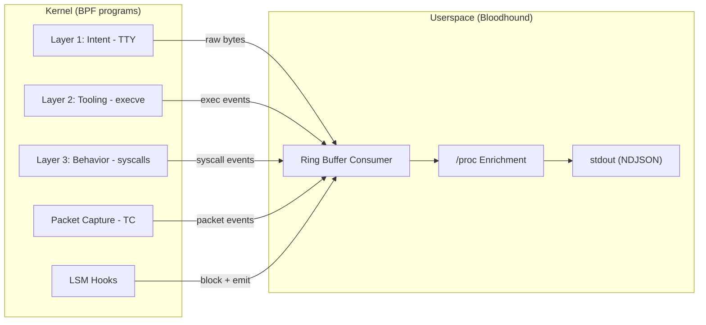

# The 3-Layer Correlation Model

Events across all three layers are linked by `auid` and `sessionid`, and
correlated in userspace.




## Layer 1: Intent (TTY Capture)

- **Objective:** Capture raw command strings entered by the target user.
- **Hook points:** `kprobe:tty_write`, `kprobe:tty_read`
- **Data flow:** BPF captures raw byte buffers and emits them to the ring
  buffer. No parsing is done in BPF.
- **Userspace responsibility:** None (raw bytes forwarded as-is; parsing is
  a downstream concern).

DECIDED: Both `tty_read` and `tty_write` are captured from initial
implementation. `tty_read` provides user input; `tty_write` provides
output context (error messages, prompts, command results).

### TTY data encoding

DECIDED: Raw TTY bytes are Base64 encoded in `args.data`. Downstream
consumers decode and parse TTY streams (ANSI escape sequences, control
characters, line editing).

### TTY device filtering

DECIDED: Two-stage filter in kprobe context:
1. Check current task's `auid` against `TARGET_AUID` (early return)
2. Check that the TTY device is a pseudo-terminal (pts/*), excluding
   physical console TTYs (tty1-6). The device can be identified from
   the `tty_struct` argument or from `current->signal->tty`.

### Why Layer 1 is required (not optional)

Layer 1 serves purposes that Layer 2 (execve) cannot:

1. Intent vs. Behavior diagnosis -- Distinguishes a user who did not
   attempt the operation (no Layer 1 event) from one who attempted but
   failed (Layer 1 present, Layer 3 failed).
2. Shell built-in capture -- Operations like `cd`, `echo > /dev/tcp/...`,
   and variable assignments are handled by the shell and never trigger
   `execve`. Layer 1 is the only way to observe them.
3. Trial-and-error analysis -- Layer 1 provides the raw sequence of
   user attempts, not just the final outcome.

### Non-interactive SSH

DECIDED: Out of scope. Only interactive SSH sessions are supported.
Non-interactive execution (e.g., `ssh user@host "cmd"`) is not a
supported scenario.

### Privacy

DECIDED: TTY data is captured as-is, including passwords typed at
sudo prompts. [ACCEPTANCE] The operator is responsible for ensuring
that privacy implications are acceptable for the deployment context.

### TTY stream parsing

DECIDED: Out of Bloodhound's scope. Bloodhound emits raw Base64-encoded
TTY bytes. Downstream consumers are responsible for decoding and parsing
(ANSI escape sequences, control characters, line editing).


## Layer 2: Tooling (Execution)

- **Objective:** Record which binaries are executed.
- **Hook points:**
  - `tracepoint:syscalls:sys_enter_execve` (primary)
  - `tracepoint:syscalls:sys_enter_execveat` (required for fd-based exec)
- **Data captured:** `filename`, `argv`, `pid`, `ppid`

### argv capture policy

DECIDED: Capture argv using a per-CPU array map as scratch buffer.
This bypasses the 512-byte BPF stack limit and allows capturing up to
~4KB of argv data. The primary purpose is identifying which program was
run and with what flags. Entries that exceed the buffer are truncated.
The total argv serialization budget is used greedily -- fill as many
entries as fit. The same per-CPU map approach is used for `filename`
in openat (up to PATH_MAX = 4096 bytes).

### envp capture

DECIDED: Not captured. argv provides sufficient context for identifying
which program was run and with what flags. envp is expensive to capture
(hundreds of bytes to kilobytes per execve) and rarely useful for
behavioral analysis. Can be added as selective capture in the future
if needed.

### Process tree tracking (fork/clone)

DECIDED: Traced via `tracepoint:syscalls:sys_enter_clone`,
`sys_exit_clone`, `sys_enter_clone3`, `sys_exit_clone3`. This provides
clone flags (CLONE_THREAD, CLONE_NEWNS, etc.) which are valuable for
detecting namespace manipulation, thread creation vs. process creation,
and other behavioral signals. Uses the same enter/exit correlation
pattern as other Layer 3 syscalls.

### Interpreter handling

DECIDED: Rely on argv. When `python script.py` is exec'd, filename
is `python` and argv is `["python", "script.py"]`. The script name is
available in argv[1]. No special interpreter detection logic.


## Layer 3: Behavior (Side Effects)

- **Objective:** Monitor actual kernel-level impact of the target user's actions.
- **Architecture:** Two-tier capture using `raw_syscalls` tracepoints.

### Tier 1: raw_syscalls (generic capture)

DECIDED: Use `tracepoint:raw_syscalls:sys_enter` and
`tracepoint:raw_syscalls:sys_exit` to capture ALL syscalls from the
target user. Each event records:

- Syscall number (NR)
- 6 raw arguments (as u64 integers)
- Return code (from sys_exit)

These events use `event.type = "SYSCALL"` and `event.layer = "behavior"`.

A configurable exclusion bitmap suppresses extremely high-frequency
internal syscalls that provide no behavioral signal. Default exclusions:
futex, clock_gettime, clock_nanosleep, gettimeofday, nanosleep,
epoll_wait, epoll_pwait, poll, ppoll, select, pselect6, sched_yield,
restart_syscall.

### Tier 1/Tier 2 deduplication

Deduplication is performed in BPF. The raw_syscalls:sys_enter handler
checks the syscall NR against a Tier 2 bitmap (a BPF array map). If
the NR is handled by a Tier 2 program, the Tier 1 handler skips it
(early return). This avoids emitting duplicate events and wasting ring
buffer space. The bitmap is populated at load time based on which Tier 2
programs are successfully attached.

### Tier 2: Rich extraction (dedicated tracepoints)

For key syscalls, dedicated BPF programs extract structured arguments
beyond raw integer values:

| Syscall              | Rich args extracted                           |
|----------------------|-----------------------------------------------|
| execve/execveat      | filename (string), argv (string array)        |
| openat               | filename (string), flags (decoded)            |
| read/write           | fd, fd_type, requested size                   |
| connect              | sockaddr (addr, port, family)                 |
| chdir                | path (string)                                 |
| fchdir               | fd (userspace resolves via /proc)             |
| bind/listen          | sockaddr (addr, port, family)                 |
| socket               | domain, type, protocol                        |
| unlink/unlinkat      | path (string)                                 |
| rename/renameat2     | oldpath (string), newpath (string)            |
| clone/clone3         | clone flags (decoded)                         |
| mkdir/mkdirat        | path (string), mode                           |
| rmdir                | path (string)                                 |
| symlink/symlinkat    | target (string), linkpath (string)            |
| link/linkat          | oldpath (string), newpath (string)            |
| chmod/fchmod/fchmodat| path or fd, mode                              |
| chown/fchown/fchownat| path or fd, uid, gid                          |
| truncate/ftruncate   | path or fd, length                            |
| mount/umount2        | source (string), target (string), fstype      |
| sendto/recvfrom      | fd, sockaddr (addr, port), size               |

Tier 2 events use `event.type = "TRACEPOINT"` with the appropriate
`event.layer` (tooling for execve, behavior for all others).

Tier 2 events supersede the corresponding Tier 1 raw event for the
same syscall invocation (see deduplication above).

### Hook points summary

**Tier 1 (generic):**
- `tracepoint:raw_syscalls:sys_enter` + `sys_exit`

**Tier 2 (rich extraction) -- each has sys_enter + sys_exit pair:**
- execve, execveat
- openat, read, write, connect, chdir, fchdir
- bind, listen, socket
- unlink, unlinkat, rename, renameat2
- clone, clone3
- mkdir, mkdirat, rmdir
- symlink, symlinkat, link, linkat
- chmod, fchmod, fchmodat, chown, fchown, fchownat
- truncate, ftruncate
- mount, umount2
- sendto, recvfrom

**Layer 1 (kprobe):**
- `kprobe:tty_read`, `kprobe:tty_write`

**Packet (TC):**
- TC classifier on all interfaces (ingress + egress)

**LSM:**
- file_open, task_kill, bpf, ptrace_access_check
- inode_unlink, inode_rename, task_fix_setuid

Note: Layer 3 coverage is conventional-syscall only. I/O submitted via
`io_uring` rings does not traverse these tracepoints; see §Known
Limitations §io_uring observation gap.

### fd type classification

DECIDED: For `read` and `write` events, the BPF program determines
the fd type by reading the `file` struct from the process's file
descriptor table. The type is classified as one of:
- `regular` (regular file)
- `pipe`
- `socket`
- `tty` (pseudo-terminal)
- `other`

This classification is included in `args` (e.g., `"fd_type": "pipe"`)
and allows downstream consumers to filter noise from pipe I/O in pipelines.

### Enter/Exit correlation

DECIDED: All Layer 3 syscalls use both `sys_enter` and `sys_exit`
tracepoints. `sys_enter` captures arguments (filename, fd, size, sockaddr).
`sys_exit` captures the return code. Correlation is done via a BPF hash
map keyed by `pid_tgid`:

1. `sys_enter`: store arguments in hash map keyed by `pid_tgid`
2. `sys_exit`: look up stored arguments, combine with return code,
   emit the complete event to ring buffer, delete map entry

This doubles the number of BPF programs but provides complete event
data including `return_code`.

### Performance note

`read` and `write` are high-frequency syscalls. The auid-based early
return filter is critical here. Only the target user's processes are traced;
system processes are excluded at the BPF level. The enter/exit
correlation map is bounded and entries are cleaned up on exit.

### Data capture granularity

DECIDED: `read`/`write` capture metadata only (fd, fd_type, requested
size, return value). Buffer content is NOT captured. This keeps BPF
overhead minimal for these high-frequency syscalls.

### chdir/fchdir capture

`chdir` captures the target path in `args.filename` (read via per-CPU map,
same as openat). `fchdir` captures the target fd in `args.fd`; userspace
resolves the path via `/proc/<pid>/fd/<N>` (best-effort). Both emit
`return_code` from `sys_exit`.


## Packet Capture (TC Hooks)

- **Objective:** Capture raw network packets for scenarios that require
  network-level behavioral analysis.
- **Hook type:** TC (Traffic Control) classifier on ingress and egress.
- **Data captured:** Full raw packet data (L2 and above).
- **event.type:** `PACKET`
- **event.layer:** `behavior`

### Key design challenge: no process context in TC hooks

TC/XDP programs execute in the network stack context, not in a process
context. There is no access to `pid`, `auid`, `comm`, or any
`task_struct` fields.

```
Syscall hooks (Layer 1-3):          TC hooks (Packet):
  process context available           NO process context
  bpf_get_current_task() works        bpf_get_current_task() N/A
  auid filtering in BPF              auid filtering NOT possible
```

DECIDED approach: full capture with userspace correlation.

Since this is a single-user VM where virtually all network traffic
originates from the target user, Bloodhound captures all packets at the TC
level without BPF-side process filtering. Correlation with a process is
performed in userspace by joining packet 5-tuples (proto, src, dst, sport,
dport) against socket information from Layer 3 `connect`/`bind` events.

```
+-------------------+       +--------------------+
| Layer 3: connect  |       | TC: packet capture |
| (pid, auid,       |       | (5-tuple, payload) |
| dst_addr, dport)  |       |                    |
+--------+----------+       +---------+----------+
         |                             |
         +-------------+---------------+
                       |
                       v
              +--------+---------+
              | Userspace join   |
              | on 5-tuple       |
              +--------+---------+
                       |
                       v
              BehaviorEvent (PACKET)
              with header.pid, header.auid
              populated from socket map
```

For PACKET events where no matching socket is found (e.g., the process
has already exited), `header.pid` and `header.ppid` are set to 0 and
`header.comm` is set to an empty string. The `header.auid` is set to
the target auid since all traffic in the VM is attributed to the target user.

### Port exclusion

DECIDED: Configurable port exclusion via `--exclude-ports` CLI flag.
Default: exclude port 22 (SSH session traffic, encrypted and not useful).
Exclusion is applied in the TC BPF program for efficiency.

### Interface attachment

DECIDED: Attach TC hooks to ALL network interfaces, including loopback.
Loopback captures inter-process communication which may be relevant for
behavioral analysis.

### Payload capture

DECIDED: Capture full raw packet data (not just headers). No protocol
parsing in Bloodhound; packets are emitted as raw bytes (Base64 encoded
in `args.data`). Downstream consumers perform protocol parsing.

Note: Full payload capture increases ring buffer pressure. The default
ring buffer size (4MB) may need to be increased for network-heavy
scenarios.

### Socket tracking table

DECIDED: 4096 entries. Sufficient for a single-user VM.

### Protocol semantic extraction is out of scope

DECIDED: Bloodhound emits raw packet bytes (Base64 in `args.data`) and
does not parse higher-layer protocols. DNS query/answer extraction,
TLS SNI extraction, HTTP header parsing, and similar are the responsibility
of downstream consumers.

This boundary is chosen deliberately: BPF-side parsing of variable-length
protocol fields (compressed DNS labels, TLS record fragmentation,
chunked HTTP) fights the verifier, while userspace parsers can rely on
mature protocol libraries. Protocols considered and declined for BPF-side
extraction:

- DNS (compressed label pointers, variable answer sections)
- TLS SNI (record fragmentation, ClientHello length variability)
- HTTP/HTTPS headers (chunked encoding, header continuation, TLS-wrapped)

Downstream pattern matchers that want to match on `domain == "example.com"`
or `sni == "..."` should layer a parser on top of the PACKET stream.


## Known Limitations

This section enumerates observation gaps that operators and downstream
matcher authors should be aware of.

### io_uring observation gap

Operations submitted via `io_uring` (reads, writes, opens, connects,
etc.) are performed by the kernel without traversing the conventional
syscall entry points that Bloodhound's tracepoints attach to (see
§Layer 3 §Hook points summary). As a result, a target user who performs
file or network I/O via io_uring will produce an `io_uring_setup` event
(visible via Tier 1 `raw_syscalls`) but the subsequent I/O operations
submitted through the ring will be invisible.

Downstream pattern matchers are encouraged to treat the observation of
`io_uring_setup` (and `io_uring_enter`, `io_uring_register`) as a signal
that the session's Layer 3 coverage may be incomplete for that process's
lifetime, and to flag affected sessions as partially-observable.

Proper coverage would require LSM hooks on io_uring command paths
(e.g., `io_uring_cmd`, `io_uring_override_creds`) with careful handling
of linked SQEs, fixed files, and registered buffers. This is considered
future work and is not part of the initial Bloodhound release.
